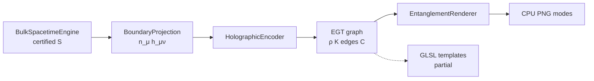

# 4D Spacetime as a Holographic Bulk — Mandala / RT4D substrate contract

**Status of this document:** **partial**  
**Claim A only:** synthetic holographic dual (encode boundary ↔ approximate reconstruct ↔ EGT/EFR).  
**Claim B:** **not claimed** — not AdS/CFT, not Ryu–Takayanagi measured, reconstruct ≠ certified bulk.

Tags: **enforced** · **partial** · **skeleton** · **declared**.

---

## Architecture



| Module | Path | Role |
|--------|------|------|
| BulkSpacetimeEngine | `mandala/holography/bulk-spacetime-engine.mjs` | Wrap proto certified state; `stepBulk` |
| BoundaryProjection | `mandala/holography/boundary-projection.mjs` | `n_μ`, `h_μν`, `projectPoint4DTo3D` |
| projector (SoT) | `mandala/holography/projector.mjs` | \(P\), \(g_{\mu\nu}\), induced \(h_{ij}\) |
| EGT | `mandala/holography/egt.mjs` | Nodes/edges/ρ/K/CausalLinks; \(\{EGT_t\}\) |
| HolographicEncoder | `mandala/holography/holographic-encoder.mjs` | `buildEGT` / `updateEGT` |
| EntanglementRenderer | `mandala/holography/entanglement-renderer.mjs` + `efr.mjs` | HEATMAP / CAUSAL / EMERGENT / COMBINED |
| Shaders | `mandala/holography/shaders/` | GLSL **partial** blueprints |

Frame loop (demo `--egt`):

```
encoder.buildEGT(bulk) → updateEGT → renderBoundary(HEATMAP|CAUSAL|…)
// optional: bulk.stepBulk(dt) then updateEGT
```

---

## Projection operator \(P: \mathbb{R}^{1,3}\to\mathbb{R}^3\)

\[
ds^2 = g_{\mu\nu} dx^\mu dx^\nu,\quad g_{\mu\nu}=\mathrm{diag}(-c^2,1,1,1)
\]

- **Naive** \(P_\mathrm{naive}(t,x,y,z)=(x,y,z)\) — loses causality/time (**insufficient alone**).
- **Unit timelike normal:** \(g_{\mu\nu}n^\mu n^\nu=-1\), \(h_{\mu\nu}=g_{\mu\nu}+n_\mu n_\nu\), \(V^\mu_\mathrm{proj}=h^\mu{}_\nu V^\nu\).
- Flat static observer \(n^\mu=(1/c,0,0,0)\) → spatial \(P\) ≡ naive; **distances on slice use \(h_{ij}\)**.

Induced 3-metric: \(h_{ij}=g_{ij}-g_{0i}g_{0j}/g_{00}\) (flat → \(\delta_{ij}\)).

`encodeBoundary` samples faces after `projectStaticObserver` and stamps `projectorDescriptor`.

---

## Time as relationships + EGT

Time is **not** a drawn axis. Sequence \(\{EGT_t\}\) **is** temporal structure.

```
EGT {
  Nodes, Edges(w_ij∈[0,1]), rho[], K[], CausalLinks C
}
EGT(t+1) = Update(EGT(t), BulkState(t))
```

### Entanglement → curvature (discrete proxies)

| Symbol | Formula | Honesty |
|--------|---------|---------|
| \(S(A)\) | \(\sum_{(i\in A,j\notin A)} f(w_{ij})\), \(f=w\) or \(w^2\) | **Not** \(\mathrm{Tr}\rho\log\rho\) |
| \(\varepsilon_i\) | \(\sum_j w_{ij}\) | local entanglement density proxy |
| \(\nabla\varepsilon_i\) | \(\sum_j(\varepsilon_j-\varepsilon_i)(x_j-x_i)/\|x\|^2\) | discrete |
| \(K_i\) | \(\alpha\|\nabla\varepsilon_i\|+\beta\Delta\varepsilon_i\) | defaults **α=1**, **β=0.25** |

Ryu–Takayanagi: **declared** inspiration only (`patchEntropyAround` helper).

---

## EFR modes

| Mode | Visual |
|------|--------|
| HEATMAP | ρ brightness, \(w\) edges, K tint |
| CAUSAL | directed CausalLinks |
| EMERGENT_GEOMETRY | mesh warp by K (**partial**) |
| COMBINED | heatmap + causal overlay |

Shaders: [`shaders/SHADER_GRAPH.md`](../../mandala/holography/shaders/SHADER_GRAPH.md) — **partial** templates; CPU PNG is working path.

---

## Steps 1–5 (translation layer)

Still present: Minkowski η, ADM \(h_{ij}\), `causalStamp`/`infoDensity` in `translate.mjs`, `computeBoundaryScreen`, metric-aware `reconstructBulkPreview` (**partial/toy** ≠ certified hash).

---

## Run

```bash
node --test mandala/holography/test/holography.test.js
node --test mandala/holography/test/tiny-scene.test.js
node --test mandala/holography/test/reconstruct.test.js
node --test mandala/holography/test/interference.test.js
node --test mandala/holography/test/ciems-lab.test.js
node --test mandala/proto/test/four-proofs.test.js
node mandala/holography/demo.mjs
node mandala/holography/demo.mjs --egt
node mandala/holography/test-scene.mjs
node mandala/holography/test-scene.mjs --interference
```

`--egt` writes `output/mandala-holography/egt-heatmap.png`, `egt-causal.png`, `egt-emergent.png`, `egt-combined.png`, `dual-bulk-boundary.png`, plus receipt node/edge counts.

### Tiny holographic test scene (end-to-end)

Isolated Bulk worldline → `z=0` grid plane → EGT ρ/w trail → K → CPU PNG (certified proto untouched).

- Module: `mandala/holography/tiny-scene.mjs`
- Runner: `node mandala/holography/test-scene.mjs`
- Artifacts: `output/mandala-holography/tiny-scene/` (`bulk-worldline.png`, `boundary-heatmap.png`, `boundary-warped.png`, `receipt.json`)
- Tests: `mandala/holography/test/tiny-scene.test.js` — trail near path, `sum(w)>0`, `max(|K|)>0`, determinism
- Reconstruction: `reconstruct.mjs` — EGT → B̂ (**partial**); `reconstructionError` on receipt
- Interference: `node mandala/holography/test-scene.mjs --interference` → `output/mandala-holography/interference/`
- CIEMS lens: [`HOLOGRAPHIC_CIEMS.md`](./HOLOGRAPHIC_CIEMS.md) (soft `stepBulk`→`updateEGT`)

**Reconstruction (partial PoC):** `mandala/holography/reconstruct.mjs` — EGT → B̂ worldline; receipt fields `reconstructionError`, `maxRhoPeakDist`. Not certified bulk rebuild.

**Interference:** `node mandala/holography/test-scene.mjs --interference` → `output/mandala-holography/interference/`.

**CIEMS lens:** [`HOLOGRAPHIC_CIEMS.md`](./HOLOGRAPHIC_CIEMS.md) — soft bulk↔EGT invariant + Stewardship metrics; Sovereign console HTML (**partial**).

---

## Toy vs real

| Piece | Tag |
|-------|-----|
| Projector \(h_{\mu\nu}\) / static \(P\) | **partial** |
| EGT + discrete \(S,\varepsilon,K\) | **partial** (proxies) |
| EFR CPU PNG | **partial** |
| GLSL EFR | **partial** / blueprint |
| Reconstruct preview | **partial/toy** |
| EGT→B̂ worldline reconstruct | **partial** PoC |
| Two-worldline interference | **partial** |
| CIEMS holography soft checks | **partial** |
| RT / HRT / MERA / QECC / true entropy | **declared** |
| AdS/CFT Claim B | **not claimed** |

---

## Gaps

1. No continuum dual; cube faces are a proxy boundary.
2. Preview reconstruct does not recover certified interior.
3. MERA, QECC, von Neumann entropy, RT area laws unimplemented.
4. GPU EFR not dispatched (templates only).
5. No constitution edits for this substrate.
