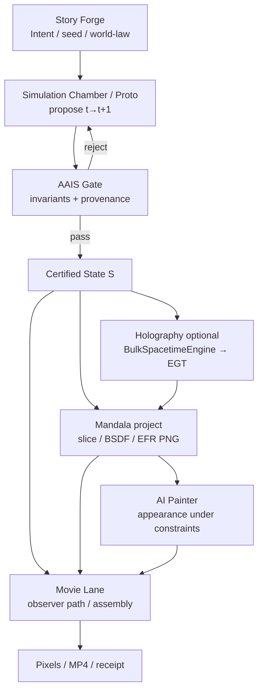

# Mandala Holographic Graphics

**Image as observation of certified informational state**

| Field | Value |
|-------|--------|
| **Document status** | **partial** — architecture paper grounded in repo evidence; not a product claim |
| **Audience** | Technical founders, rendering engineers, curious outsiders |
| **Claim A (in scope)** | Computational usefulness of holography / RHFD / EGT analogues |
| **Claim B (out of scope)** | AdS/CFT as proven physics; physical vacuum identity |
| **Does not claim** | Unreal/Unity/Blender replaced; living organisms; production film beauty by default |

**Illustrative figures (not physics proofs):**  
[`output/mandala-full-stack/final.png`](../../../output/mandala-full-stack/final.png) · [`output/mandala-holography/tiny-scene/`](../../../output/mandala-holography/tiny-scene/)

---

## 1. Abstract

Contemporary graphics pipelines treat the frame as the primary object of reality: a game loop advances pose and materials, a renderer paints pixels, and the next tick discards most of what was not baked into meshes or keyframes. Mandala inverts that priority. The durable object is a *certified informational state*—fields, topology, and relational structure that may live in four-dimensional spacetime (bulk) and/or as an entanglement-graph boundary (EGT). Pixels are *observations*: projections of that state onto an observer manifold, gated by constitutional invariants and provenance.

This white paper explains the holographic dual (bulk ↔ boundary), the projection operator \(h_{\mu\nu}\), character skin as informational boundary, and the organ loop Story Forge → Chamber/proto → Mandala → Painter → Movie Lane. It argues for carefully provisional paradigm shifts: assets as informational programs, animation as state evolution under law, and beauty as constrained stewardship rather than free-floating texture synthesis.

Honesty is binding. Where the repo is **working**, **partial**, **skeleton**, or **declared**, this paper says so. Claim A (computational usefulness) applies to holography / RHFD / EGT. Claim B (AdS/CFT / physical vacuum) is **not claimed**. Independence from Unreal is **aspirational**. Character biomechanics are **partial** toys, not living anatomy.

Primary contracts: [`HOLOGRAPHIC_BULK_BOUNDARY.md`](../HOLOGRAPHIC_BULK_BOUNDARY.md), [`CHARACTER_HOLOGRAPHY.md`](../CHARACTER_HOLOGRAPHY.md), [`HOLOGRAPHIC_CIEMS.md`](../HOLOGRAPHIC_CIEMS.md), [`GOVERNED_SYNTHETIC_WORLD_RUNTIME.md`](../GOVERNED_SYNTHETIC_WORLD_RUNTIME.md).

---

## 2. The problem with frame-centric graphics

The industry default is a loop that looks roughly like:

```
game loop → physics / animation → material & light → framebuffer → next frame
```

That loop has been extraordinarily successful. It also encodes several assumptions that become liabilities once you care about *certified* worlds, *replayable* cinema, or *governance* of generative appearance:

1. **The framebuffer defines the moment.** What “happened” is what was drawn. Intermediate state is ephemeral; provenance is optional.
2. **Assets are geometry-first.** Characters arrive as meshes, blendshapes, and skinning weights. Information that could live on a boundary (stress, entanglement density, causal adjacency) is secondary or absent.
3. **Animation is keyframe or clip playback.** Time is a scrubber over authored curves, not a sequence of certified informational graphs.
4. **The renderer owns truth at the edge.** If the shader says so, it is so—even when the result violates mass, causality, or author intent declared elsewhere.
5. **Beauty is decoupled from law.** Image models and PBR stacks can invent appearance that no simulation or narrative constraint can later reconstruct or audit.

Game engines optimize for interactive frame rate under these assumptions. Mandala’s product identity is different: a *governed synthetic-world runtime* ([`GOVERNED_SYNTHETIC_WORLD_RUNTIME.md`](../GOVERNED_SYNTHETIC_WORLD_RUNTIME.md)), not “a game engine with better graphics.” The proto under `mandala/proto/` exists to prove that certified state can precede pixels, and that projection must not mutate that state (proof 4 in `mandala/proto/test/four-proofs.test.js`).

Frame-centric graphics are not “wrong.” They are incomplete for a class of problems Mandala takes seriously: worlds that must remain lawful under organ proposals, movies that reconstruct slices without re-simulating from \(t=0\), and visual audits that show *why* a surface looks the way it does.

---

## 3. Thesis: image as observation of certified informational state

**Thesis.** In Mandala, an image is an *observation of certified informational state*, not the definition of reality. Reality (synthetic) is a state \(S\) that has passed a constitutional gate. Mandala and Movie Lane answer: *what does \(S\) look like from this observation manifold?* They do not decide what \(S\) is.

The governed loop ([`GOVERNED_SYNTHETIC_WORLD_RUNTIME.md`](../GOVERNED_SYNTHETIC_WORLD_RUNTIME.md)):

```
Constitutional Laws → Certified 4D State S(…)
  → organs propose transitions
  → Constitutional Gate (invariants / contracts)
  → pass: New Certified State
  → 4D Projection (Mandala) + Movie Lane (observer path)
```

Two consequences follow.

**First, the renderer is subordinate.** Proof 4 in the proto: project from a frozen copy; the certified hash is unchanged after render. Mutating a snapshot cannot touch certified buffers (`mandala/proto/`, `mandala/proto/README.md`).

**Second, holography is a dual language for the same thesis.** Bulk fields (spacetime lattice, \(\varphi\), \(\nabla\varphi\), defect worldlines) and boundary graphs (EGT nodes, edges \(w_{ij}\), \(\rho\), \(K\), causal links) are two representations of informational structure. The image may be painted from either—or from both as a dual view—without promoting either to Claim B physics.

This is Claim A: a *computationally useful* holographic dual. It is not a claim that Mandala has implemented AdS/CFT, measured Ryu–Takayanagi, or certified reconstructible bulk from boundary entropy.

---

## 4. Dual representation: Bulk ↔ Boundary (EGT)

### 4.1 Bulk

The bulk side wraps certified proto state and advances a lab-scale spacetime step:

| Module | Path | Role | Status |
|--------|------|------|--------|
| BulkSpacetimeEngine | `mandala/holography/bulk-spacetime-engine.mjs` | Wrap certified \(S\); `stepBulk` | **partial** |
| Proto chamber | `mandala/proto/` | 32³ × 64 certified lattice, mass conservation | **partial** / proofs **enforced** |
| RHFD substrate | `mandala/substrate/` | η, defects, lattice mapping (Claim A) | **partial** |

RHFD (Claim A only): η → deterministic perturbation; ∇V → vector/defect walk; defects → worldlines. Claim B / physical vacuum is **not claimed** ([`GOVERNED_SYNTHETIC_WORLD_RUNTIME.md`](../GOVERNED_SYNTHETIC_WORLD_RUNTIME.md) §6).

### 4.2 Boundary (EGT)

The boundary dual is an *Entanglement Graph Tensor* sequence \(\{EGT_t\}\):

```
EGT {
  Nodes, Edges(w_ij ∈ [0,1]), rho[], K[], CausalLinks C
}
EGT(t+1) = Update(EGT(t), BulkState(t))
```

| Module | Path | Role | Status |
|--------|------|------|--------|
| HolographicEncoder | `mandala/holography/holographic-encoder.mjs` | `buildEGT` / `updateEGT` | **partial** |
| EGT | `mandala/holography/egt.mjs` | Nodes/edges/ρ/K/CausalLinks | **partial** |
| EntanglementRenderer / EFR | `mandala/holography/entanglement-renderer.mjs`, `efr.mjs` | HEATMAP / CAUSAL / EMERGENT / COMBINED | **partial** (CPU PNG working path) |

Discrete proxies (not von Neumann entropy):

| Symbol | Meaning | Honesty |
|--------|---------|---------|
| \(S(A)\) | Cut weight proxy | **Not** \(\mathrm{Tr}\rho\log\rho\) |
| \(\varepsilon_i\) | Local entanglement density | Proxy |
| \(K_i\) | \(\alpha\|\nabla\varepsilon\|+\beta\Delta\varepsilon\) | Defaults α=1, β=0.25 |
| Ryu–Takayanagi | Inspiration | **declared** only |

Contract: [`HOLOGRAPHIC_BULK_BOUNDARY.md`](../HOLOGRAPHIC_BULK_BOUNDARY.md). Tests: `mandala/holography/test/*.js`. Tiny end-to-end scene: `mandala/holography/tiny-scene.mjs` → `output/mandala-holography/tiny-scene/`.

### 4.3 Soft CIEMS lens

Holography modules also act as a *governance lens* (vocabulary borrowed from Engine3D / Sovereign stack; **no charter edits**):

> Soft invariant: no bulk state change without corresponding boundary EGT update  
> (`stepBulk` → `encoder.updateEGT`) — **partial** in `mandala/holography/ciems-lab.mjs`, **not** AAIS-blocking.

See [`HOLOGRAPHIC_CIEMS.md`](../HOLOGRAPHIC_CIEMS.md).

---

## 5. Projection operator \(h_{\mu\nu}\) and time-as-relationships

### 5.1 Geometry of observation

Spacetime metric (flat Minkowski form used in the toy projector):

\[
ds^2 = g_{\mu\nu}\,dx^\mu dx^\nu,\qquad g_{\mu\nu}=\mathrm{diag}(-c^2,1,1,1)
\]

Naive projection \(P_\mathrm{naive}(t,x,y,z)=(x,y,z)\) drops causality. Mandala’s projector (`mandala/holography/projector.mjs`, `boundary-projection.mjs`) uses a unit timelike normal \(n^\mu\) and the induced spatial projector:

\[
h_{\mu\nu}=g_{\mu\nu}+n_\mu n_\nu,\qquad V^\mu_\mathrm{proj}=h^\mu{}_\nu V^\nu
\]

For a static observer \(n^\mu=(1/c,0,0,0)\), spatial \(P\) coincides with naive drop of \(t\), but *distances on the slice* are measured with \(h_{ij}\). Status: **partial** — flat static case; continuum dual and GPU EFR remain incomplete ([`HOLOGRAPHIC_BULK_BOUNDARY.md`](../HOLOGRAPHIC_BULK_BOUNDARY.md)).

**Meaning for graphics:** a camera is not “where the pixels are”; it is a choice of observation manifold and normal. Movie Lane may travel through *already certified* spacetime without calling the integrator to “play” the movie ([`GOVERNED_SYNTHETIC_WORLD_RUNTIME.md`](../GOVERNED_SYNTHETIC_WORLD_RUNTIME.md) §3).

### 5.2 Time as relationships

Time is not drawn as a fourth axis on screen. The sequence \(\{EGT_t\}\) *is* temporal structure: causal links \(C\), edge updates, and ρ/K evolution. Animation, in this vocabulary, is *relational update under bulk constraints*—not a clip library. That is the Claim A design; production clip-quality animation remains elsewhere (**partial** / cinematic Chamber still pose-interpolates when `--solver pose`).

---

## 6. Character: skin as boundary, anatomy from information (**partial**)

Character holography maps the same dual onto `character/`:

| Energy / entanglement | → | Boundary information on **skin** |
| Mesh | → | Emergent geometry from that information |
| Textured render | → | Bulk manifestation (rig / anatomy **toy**) |

Contract: [`CHARACTER_HOLOGRAPHY.md`](../CHARACTER_HOLOGRAPHY.md). Modules under `character/holography/` import EGT/EFR from `mandala/holography/` — **no second theory**.

Working ideas at **partial** fidelity:

- **Skin EGT** (`skin-egt.mjs`): vertices → nodes; \(B_i\), \(\rho\), \(w_{ij}\) from adjacency + bone similarity + material region.
- **MuscleRegion** (`muscle.mjs`): activate/deform/fire via ρ and fiber-aligned edge weights—not blendshapes.
- **Curvature → activation** (`curvature-activation.mjs`): \(K\to A_k\).
- **Face patch** (`face-egt.mjs`): expression as boundary ρ/w patterns; production face retopo = **declared**.
- **Anatomy synthesis / bulk-toy** (`anatomy-synthesis.mjs`, `bulk-toy.mjs`): bones ≈ high-\(K\) paths, muscles ≈ high-ρ clusters — **partial/toy**, not osteology.
- **Constitutional motion** (`constitutional-motion.mjs`): Intent → Evidence → Conformance → Stewardship loops — **partial**.

**Explicit non-claims:** living organisms; production biomechanics; “realistic by default”; governed reconstructable body as enforced product ([`CHARACTER_HOLOGRAPHY.md`](../CHARACTER_HOLOGRAPHY.md) honesty table).

Visible smoke: `node character/holography/e2e-showcase.mjs` → `output/character-holography/e2e-showcase/frame-final.png` ([`E2E_SHOWCASE.md`](../E2E_SHOWCASE.md)).

---

## 7. Constitutional loop: Intent → Evidence → Conformance → Stewardship

Mandala does not treat governance as a post-hoc watermark. Organs have constitutional responsibilities ([`README.md`](../../../README.md) organ map; [`GOVERNED_SYNTHETIC_WORLD_RUNTIME.md`](../GOVERNED_SYNTHETIC_WORLD_RUNTIME.md) §9):

| Organ | Owns | Does not own | Status (high level) |
|-------|------|--------------|---------------------|
| Story Forge | Intent, narrative constraints, world-law | Pixels, time integration | **partial** |
| Simulation Chamber | \(t\to t+1\) evolution | Observer playback | **partial** (proto lattice vs cinematic pose) |
| Mandala | Geometry, fields, visibility, projection | Certified truth | **partial** |
| AI Painter | Appearance under state constraints | Reality | **partial** |
| Mythar | Acoustic field / speech | Time | **partial** |
| AAIS | Invariants, provenance, arbitration | Creative authorship | ABI **working**; full arbitration **partial** |
| Movie Lane | Observer path, editing, assembly | Time integrator | **partial** |

**Intent.** Declared purpose before mutation (agent law P1; runtime policy `policy-no-execution-without-intent`). Story Forge and organ proposals carry intent; holography character motion loops echo the same pattern.

**Evidence.** State change requires verifiable reason (P2). Proto receipts, holography `receipt.json`, painter provenance, and four-proof tests are evidence surfaces.

**Conformance.** Gates check invariants. Proto enforces scalar-mass conservation: illegal mass injection is rejected (`mandala/proto/aais-gate.mjs`). Soft holography CIEMS checks emit receipt `ok: false` without blocking root AAIS (**partial**, not charter-enforced).

**Stewardship.** EFR heatmaps, reconstruction-error metrics, Sovereign console HTML (`mandala/holography/console/`), and H_gov dashboards are audit/visualization layers—Stewardship in the CIEMS lens sense ([`HOLOGRAPHIC_CIEMS.md`](../HOLOGRAPHIC_CIEMS.md)).

**Governance preserves laws, not equilibrium.** Explosions and fracture may be lawful; illegal transitions may not ([`GOVERNED_SYNTHETIC_WORLD_RUNTIME.md`](../GOVERNED_SYNTHETIC_WORLD_RUNTIME.md) §2). Authors may declare exotic constitutions (e.g. memory-gravity — **declared**, not executed); that instantiates a different law, not “invalid physics” in the product sense.

**Provenance.** Frame/receipt fields (intent, world, timeline, parameters) and organ ABI freeze `mandala-engine-organ.v1` (`mandala/engine/ABI.md`) bind pixels back to certified process. Full production crypto / REST state store remains **no** for now ([`INDEPENDENCE_ROADMAP.md`](../INDEPENDENCE_ROADMAP.md)).

---

## 8. How images are produced in this stack

Illustrative collage of multiple organs: `node scripts/full-stack-showcase.mjs` → [`output/mandala-full-stack/final.png`](../../../output/mandala-full-stack/final.png) ([`FULL_STACK_SHOWCASE.md`](../FULL_STACK_SHOWCASE.md)). Not a production film.



**ASCII equivalent:**

```
Story Forge (intent)
       │
       ▼
Chamber / proto (propose evolution)
       │
       ▼
   AAIS gate ──reject──► (no certified mutation)
       │ pass
       ▼
 Certified S ──► Mandala project (± holography EGT/EFR)
       │                    │
       │                    ▼
       │              AI Painter (constrained appearance)
       │                    │
       └──────────► Movie Lane (observe / edit / assemble)
                           │
                           ▼
                    PNG / MP4 + receipt
```

**Concrete paths:**

| Stage | Evidence |
|-------|----------|
| Proto run | `node mandala/proto/run.mjs` → `output/mandala-proto/` |
| Proto proofs | `npm run test:mandala-proto` / `mandala/proto/test/four-proofs.test.js` |
| Holography EGT demo | `node mandala/holography/demo.mjs --egt` |
| Tiny holographic scene | `node mandala/holography/test-scene.mjs` → `output/mandala-holography/tiny-scene/` |
| Character E2E | `node character/holography/e2e-showcase.mjs` |
| Engine e2e | `node mandala/engine/run-e2e.mjs` |
| Open painter golden | `node scripts/golden-painter.mjs` → `output/mandala-painter-open/` |
| Full-stack collage | `node scripts/full-stack-showcase.mjs` |

Vulkan sits *above* the mathematical contract: CPU reference is proto truth; one ∇φ kernel may match within `1e-4` or skip blocked-with-evidence ([`GOVERNED_SYNTHETIC_WORLD_RUNTIME.md`](../GOVERNED_SYNTHETIC_WORLD_RUNTIME.md) §4). Backends do not redefine legality.

---

## 9. What this changes for graphics in general (provisional)

These are *directions suggested by the architecture*, not market claims that Mandala has already replaced existing DCCs.

| Shift | From | Toward (Mandala Claim A) | Caution |
|-------|------|--------------------------|---------|
| **Ontology of the image** | Framebuffer as reality | Observation of certified \(S\) | Requires durable state + gates |
| **Asset model** | Mesh + maps + clips | Informational program (fields + EGT + constitution) | Compilers **declared**; proto is hand-compiled tiny universe |
| **Animation** | Keyframes / mocap clips | Relational EGT update + lawful Chamber transport | Cinematic path still often pose-interp |
| **Character** | Blendshapes + skinning | Skin boundary ρ/K driving deformation | **partial** toys; not living organisms |
| **Beauty** | Unconstrained generative fill | Painter under state + provenance | Film PBR / SD beauty often **partial** / hardware-limited |
| **Time** | Scrubber owns playback = sim | Movie Lane observes; Chamber owns \(t\to t+1\) | Discipline easy to violate in tooling |
| **Audit** | Screenshots + logs | Dual bulk/boundary receipts, EFR stewardship views | Soft CIEMS ≠ charter enforcement |
| **Backend** | GPU as truth | Contract above Vulkan/CPU | Matches Axiom-X lesson in runtime doc |

For founders: the product bet is *governed worlds and certifiable cinema*, not FPS competition with Unreal. For rendering engineers: the interesting math is projector \(h_{\mu\nu}\), discrete entanglement proxies, and proof that projection does not mutate certified buffers. For outsiders: think “hologram of a lawful simulation” rather than “prettier shader pack”—and remember the hologram here is a software dual, not a claim about quantum gravity.

Independence from Unreal/Unity/Blender remains **declared / aspirational** ([`INDEPENDENCE_ROADMAP.md`](../INDEPENDENCE_ROADMAP.md)).

---

## 10. What is implemented vs not

| Capability | Status | Evidence |
|------------|--------|----------|
| Proto four proofs (determinism, GPU∇φ tolerance, cache reconstruct, render≠mutate) | **enforced** | `mandala/proto/test/four-proofs.test.js` |
| Certified state + mass-conservation gate (tiny scale) | **partial** / working | `mandala/proto/certified-state.mjs`, `aais-gate.mjs` |
| Organ ABI v1 freeze | **working** | `mandala/engine/ABI.md` |
| Projector \(P\) / \(h_{\mu\nu}\) (static) | **partial** | `mandala/holography/projector.mjs` |
| EGT + discrete \(S,\varepsilon,K\) | **partial** (proxies) | `mandala/holography/egt.mjs` |
| EFR CPU PNG modes | **partial** | `entanglement-renderer.mjs`, `efr.mjs` |
| Tiny scene + interference labs | **partial** | `tiny-scene.mjs`, `test-scene.mjs --interference` |
| EGT→B̂ reconstruct | **partial/toy** | `reconstruct.mjs` |
| Soft bulk↔EGT CIEMS lab | **partial** (not AAIS-blocking) | `ciems-lab.mjs` |
| Character skin/muscle/face holography | **partial** | `character/holography/` |
| Creature templates / Mythar spawn | **partial** | [`HOLOGRAPHIC_CREATURES.md`](../HOLOGRAPHIC_CREATURES.md) |
| GLSL EFR GPU dispatch | **partial** / blueprint | `mandala/holography/shaders/` |
| RT / HRT / MERA / QECC / true entropy | **declared** | — |
| AdS/CFT Claim B | **not claimed** | — |
| Full anatomical RT4D reconstruct / living taxonomy | **declared** | — |
| World compiler (intent→spacetime program) | **declared** | runtime doc §7 |
| Mandala IDE / GLB→lattice compiler | **declared** | README Declared |
| Independence from Unreal/Unity/Blender | **declared** / aspirational | Independence roadmap |
| Post &lt;15ms @1080p, film SSS/fur | **no** | Independence success metrics |
| Production AAIS crypto + REST state SoT | **no** | Phase 2 gaps |

Root Working vs Partial table: [`README.md`](../../../README.md).

---

## 11. Risks, limits, and open problems

1. **Proxy entropy is not physics entropy.** Edge-weight cuts and \(\varepsilon\)-gradients can drive interesting deformation and heatmaps; they do not establish holographic duality theorems.
2. **Cube-face / mesh-skin boundaries are coarse.** Continuum duals, true RT area laws, and certified bulk recovery from boundary remain open ([`HOLOGRAPHIC_BULK_BOUNDARY.md`](../HOLOGRAPHIC_BULK_BOUNDARY.md) Gaps).
3. **Scale.** Proto is 32³ × 64—not production world volume. Dense 512⁴ is explicitly refused.
4. **Parallel runtimes.** Prefer proto + `mandala/engine/` over duplicating certified stores under RT4D sketches ([`INDEPENDENCE_ROADMAP.md`](../INDEPENDENCE_ROADMAP.md)).
5. **Honesty drift.** Marketing language (“living,” “beats Unreal,” “AdS/CFT”) can outrun tags. AGENTS.md and these docs exist to prevent that.
6. **Hardware.** Live demo constraints (e.g. RX 580 / RAM limits) make SD painter and GPU beauty **partial** or **blocked-with-evidence**; collage showcases skip heavy organs by design.
7. **Soft vs hard governance.** Holography CIEMS receipts can fail without blocking Chamber. Operators must not confuse lab lenses with constitutional enforcement.
8. **Character gap.** Skin EGT demos ≠ production retopo, facial systems, or biomechanics. Treating toy anatomy as medical or creature-AI “life” would be a category error.

Open problems worth research investment (still Claim A): better informational metrics than \(w_{ij}\) proxies; signature-compatible character WGSL on shade paths; world-compiler from intent+constitution; GPU EFR that preserves receipt identity with CPU reference.

---

## 12. Conclusion and citations

Mandala’s holographic and constitutional approach changes graphics by relocating *truth* from the framebuffer to certified informational state, and by giving that state a dual language: bulk spacetime fields and boundary entanglement graphs. Images become observations—projections under \(h_{\mu\nu}\), Movie Lane paths, EFR audits, and constrained painters—rather than the sole ledger of what happened.

What is already real in-repo is modest and checkable: proto proofs, EGT/EFR CPU labs, character skin holography demos, organ ABI, and collage showcases. What is not real is Claim B physics, Unreal replacement, and living organisms. The useful bet is that *lawful, dual, observable worlds* are a better foundation for synthetic cinema and governed simulation than frame-centric asset pipelines alone—if honesty about status tags is kept as strict as the gates.

### Core citations (repo)

- [`docs/mandala/HOLOGRAPHIC_BULK_BOUNDARY.md`](../HOLOGRAPHIC_BULK_BOUNDARY.md) — bulk ↔ boundary contract  
- [`docs/mandala/CHARACTER_HOLOGRAPHY.md`](../CHARACTER_HOLOGRAPHY.md) — skin boundary / rig bulk  
- [`docs/mandala/HOLOGRAPHIC_CIEMS.md`](../HOLOGRAPHIC_CIEMS.md) — governance lens  
- [`docs/mandala/GOVERNED_SYNTHETIC_WORLD_RUNTIME.md`](../GOVERNED_SYNTHETIC_WORLD_RUNTIME.md) — runtime principle  
- [`docs/mandala/INDEPENDENCE_ROADMAP.md`](../INDEPENDENCE_ROADMAP.md) — phases & non-claims  
- [`docs/mandala/FULL_STACK_SHOWCASE.md`](../FULL_STACK_SHOWCASE.md) · [`E2E_SHOWCASE.md`](../E2E_SHOWCASE.md)  
- [`docs/mandala/MANDALA_ENGINE_ROADMAP.md`](../MANDALA_ENGINE_ROADMAP.md) — engine identity  
- [`README.md`](../../../README.md) — Working / Partial / Declared  
- [`mandala/holography/`](../../../mandala/holography/) · [`character/holography/`](../../../character/holography/) · [`mandala/proto/`](../../../mandala/proto/)  
- [`AGENTS.md`](../../../AGENTS.md) — agent lawbook & status-tag discipline  

### Illustrative outputs (not proofs)

- `output/mandala-full-stack/final.png`  
- `output/mandala-holography/tiny-scene/` (`bulk-worldline.png`, `boundary-heatmap.png`, `boundary-warped.png`, `receipt.json`)  
- `output/character-holography/e2e-showcase/frame-final.png`  

---

*Document type: architecture white paper · Claim A only · status tags binding · no constitution edits implied.*
