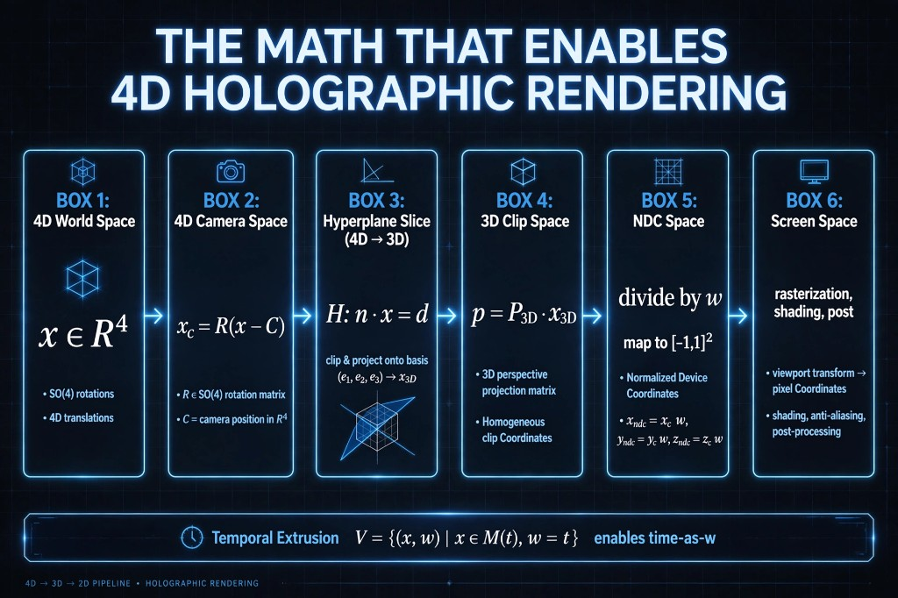
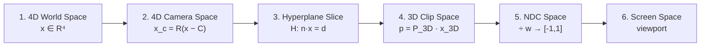
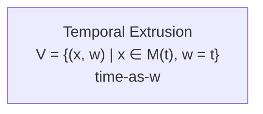

# 4D → 3D → 2D Pipeline

**Projection chain** that maps a 4D world through a camera, hyperplane slice, 3D clip, NDC, and a 2D viewport.

This is **not** the holographic ρ / h_ij / COMPOSITE recorder. Those live in `mandala/holography/` and the chamber path. Status tags follow AGENTS.md: **enforced** / **partial** / **declared** / **skeleton**.



*Source image: user-provided infographic (copied, not regenerated). Footer: `4D → 3D → 2D PIPELINE • HOLOGRAPHIC RENDERING`.*



Orthogonal (bottom bar, not a seventh projection stage):



API: `@mrs/renderer-core/math4d` (`transformPipeline`, `toCameraSpace`, `sliceTo3D`, `toClipSpace`, `clipToNdc`, `ndcToScreen`).  
SoT math: `src/math/{vec4,so4,hyperplane,clip,project}.js`, `src/math3d/mat4.js`, `src/camera/Camera4D.js`.  
Status map: `src/math4d/README.md` (`MATH4D_STATUS`, `PIPELINE_STAGE_STATUS`).

---

## Math-first contract

These six stages **are** the projection contract. Full axiom chain, boxed renderer equation, backend question, and three-layer caution: **[`CONTRACT.md`](./CONTRACT.md)**.

\[
I = \mathcal{R}\bigl(\Pi_{3\to 2}\bigl[\Pi_{4\to 3}(R_4 X)\bigr]\bigr)
\]

`transformPipeline` ≡ \(\Pi_{3\to 2} \circ \Pi_{4\to 3} \circ R_4\) (plus camera origin \(X\mapsto R_4(X-C)\)). \(\mathcal{R}\) is **not** in this chain.

| Symbol | Maps to | Status |
|--------|---------|--------|
| \(R_4 X\) | SO(4) / Rot4 / `toCameraSpace`; `Camera4D` pose → \(R_{\mathrm{view}}=R_{\mathrm{pose}}^{\mathsf{T}}\) | **enforced** |
| \(\Pi_{4\to 3}\) | Hyperplane \(H: n\cdot x=d\) onto \((e_1,e_2,e_3)\) — `sliceTo3D` | **enforced** |
| \(\Pi_{3\to 2}\) | Stages 4–6: \(P_{3D}\) clip + NDC \(\div w\) + viewport | **enforced** (viewport); raster **declared** |
| \(\mathcal{R}\) | Host raster / shade / post | **declared** |

**Layers (do not collapse):** mathematical **enforced** (JS/CPU) · numerical **partial** · physical **declared**. Passing 1 and 2 does not prove 3.

Compose / compiler / Rosetta (three jobs; holography is a different contract): **[`ROSETTA.md`](./ROSETTA.md)**.

---

## Stages

| # | Infographic | Formula | Facade | Status |
|---|-------------|---------|--------|--------|
| 1 | **4D World Space** | \(x \in \mathbb{R}^4\); SO(4) rotations; 4D translations | `vec4`, `rot4FromAngles` / `buildSO4` | **enforced** |
| 2 | **4D Camera Space** | \(x_c = R(x - C)\), \(R \in SO(4)\), \(C \in \mathbb{R}^4\) | `toCameraSpace(x, R, C)` | **enforced** |
| 3 | **Hyperplane Slice (4D → 3D)** | \(H: n \cdot x = d\); clip & project onto \((e_1,e_2,e_3) \to x_{3D}\) | `sliceTo3D` / `projectToSlice3D`; mesh clip `sliceTriangle` / `clipTriangle` | **enforced** |
| 4 | **3D Clip Space** | \(p = P_{3D} \cdot x_{3D}\) (homogeneous clip) | `toClipSpace` + `perspectiveP3D` (`math3d.perspectiveMat4`) | **enforced** |
| 5 | **NDC Space** | \(x_{ndc}=x_c/w,\ y_{ndc}=y_c/w,\ z_{ndc}=z_c/w\); map to \([-1,1]\) | `clipToNdc` | **enforced** |
| 6 | **Screen Space** | viewport → pixels; raster, shading, AA, post | `ndcToScreen` (viewport only) | **partial** (viewport **enforced**; raster/shading/post **declared**) |

**Temporal Extrusion** — \(V = \{(x, w) \mid x \in M(t),\ w = t\}\) enables time-as-w. Facade: `extrudeBetween` / `sliceExtrudedAtW`. Status: **partial** (matching topology). Remeshing: **declared**.

---

## What the infographic subscript \(c\) means

After stage 4, the diagram’s \(x_c, y_c, z_c\) are **clip** coordinates, not 4D camera space. Stage 2’s \(x_c\) is camera-space \(\mathbb{R}^4\). The code uses `camera` vs `clip` so those are not mixed.

---

## Camera pose vs diagram \(R\)

The diagram’s \(R\) is the **view** rotation (camera-from-world): \(x_c = R(x - C)\).

`Camera4D.orientation` is a **world pose**. Adapters apply \(R_{\mathrm{view}} = R_{\mathrm{pose}}^{\mathsf{T}}\):

- `viewRotationFromCamera(camera)`
- `worldToCamera(camera, x)` → `toCameraSpace(x, R_view, C)`
- `transformPipelineFromCamera4D(camera, x)`

`Camera4D.project` remains a fused soft-raster shortcut (translate, \(R^{\mathsf{T}}\), basis dots, \(d_3\) to pixels). That is **not** the \(P_{3D}\) clip factorization. Use `transformPipeline` to match the six boxes.

---

## Matrix conventions (do not invent a second stack)

| Object | Layout | Apply |
|--------|--------|-------|
| SO(4) \(R\) | row-major (`src/math/so4.js`) | `mat4apply` |
| \(P_{3D}\) | column-major (`src/math3d/mat4.js`) | `applyMat4ToVec4` |

---

## Honest non-claims

- **Not** GPU holographic interference (ρ, \(h_{ij}\), COMPOSITE). Recorder status: **declared** in this math package (`PIPELINE_STAGE_STATUS.holographicRecorder`).
- **Not** photoreal film PBR. Lambert/GGX audit constants stay \(\mathrm{BRDF} = 3\rho/(4\pi)\), \(\mathrm{pdf} = 3\cos\theta/(4\pi)\).
- Screen-space raster, shading, anti-aliasing, and post-processing are **declared** here; hosts (canvas / RT4D / chamber) own those.
- FOV on `Camera4D` via `applyPerspectiveParams` maps degrees → `d3` (**partial** approximation). `perspectiveP3D` takes **radians**.

---

## Tests

```bash
cd mrs/packages/renderer-core
npm run test:math4d
```

Deterministic composition fixture: `math4d.test.js` → `Infographic 4D→3D→2D pipeline`.  
Backend question: `math4d.test.js` → `Math-first contract` → “backend must preserve mathematical contract.”

Debug viewer (**partial**): `mrs/packages/renderer-core/tools/math4d-debug/index.html`  
Temporal chamber demo (**partial**): `node scripts/simulation-chamber-temporal.mjs scene-temporal-4d`  
Package copy of this note: [`mrs/packages/renderer-core/docs/math4d/PIPELINE.md`](../../mrs/packages/renderer-core/docs/math4d/PIPELINE.md)
