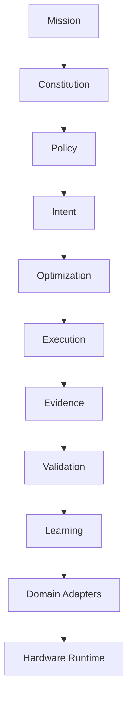

# IDAC Formal Specification v0.1

**SoT** for stack semantics alongside [IDAC_CONSTITUTION.md](./IDAC_CONSTITUTION.md).

## Articles I–X (formal)

| Art | Layer | Mode | Summary |
|-----|-------|------|---------|
| I | Mission | declared | Highest non-constitutional aim |
| II | Constitution | declared | Six invariants; supremacy over policy/optimizer |
| III | Policy | partial | Advisory; cannot override invariants |
| IV | Intent | partial | Normative pivot; CIEMS IntentContract |
| V | Optimization | partial | Propositional ExecutionPlan only |
| VI | Execution | partial | Plan-faithful; PlanViolation on breach |
| VII | Evidence | partial | Replayable EvidenceContract |
| VIII | Validation | skeleton | Intent ↔ Evidence re-judge |
| IX | Learning | skeleton | Post-validation only |
| X | Domain adapters | partial | Rendering v1.0 first |

## Layer stack (ASCII)

```text
Mission
  ↓
Constitution (6 invariants)
  ↓
Policy (advisory; Constitution wins)
  ↓
Intent  ← pivot (should happen)
  ↓
Optimization (ExecutionPlan)
  ↓
Execution (Runtime)
  ↓
Evidence
  ↓
Validation
  ↓
Learning
  ↓
Domain Adapters (render | ai | compile)
  ↓
Hardware / Runtime (Genblaze, Engine3D, …)
```



## Router flow (ASCII)

```text
Client → Router.handle_intent
  → validate Intent
  → bind Policy (trace)
  → Optimizer.request_plan
  → validate ExecutionPlan
  → RenderExecutor.execute
  → collect Evidence
  → Validation
  → Learning stub
  → recordkeeping (JSON bundle)
```

## Optimizer flow (ASCII)

```text
Intent + Policy + Constitution + Environment
  → domain adapter (render: ATCM + planner)
  → DomainPlan   (RenderPlan, normalized_plan, …)
  → ResourcePlan (dispatch target)
  → RiskPlan     (PlanViolation policy)
  → EvidencePlan (artifacts to collect)
  → plan_id + environment_spec
```

## Rendering adapter flow (ASCII)

```text
IntentContract (render)
  → RenderOptimizerAdapter
      → validate_atcm_prerequisites (if ATCM)
      → plan_atcm → build_atcm_contract_bundle → RenderPlan
      → derive_math_strategies (metadata)
  → build_plan → normalized_plan
  → build_dispatch_target → ResourcePlan
  → RenderExecutor → dispatch_render (full-frame today)
  → ComplexityEvidence + ReplayRecord → Evidence.artifacts
```

## CIEMS contracts

See `schemas/idac-intent.schema.json`, `idac-execution-plan.schema.json`, `idac-evidence.schema.json`.

RenderAccel specializations remain under `RenderPlan`, `ComplexityEvidence`, `ReplayRecord` — nested in `domain_plan` / `artifacts`.
