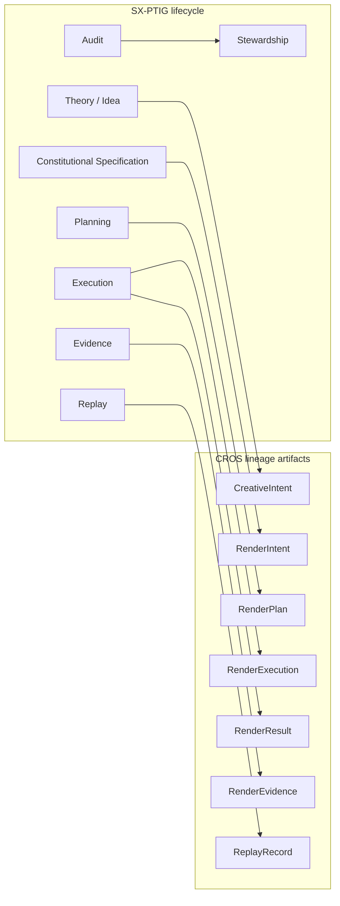

# CROS × Common Constitutional Lifecycle (SX-PTIG)

> **Drive-G-1:** This document **links** CROS CI-001..006 to the shared lifecycle. It does **not** claim that CROS runtime-enforces SX-PTIG, nor that CI-* are system-wide gates outside this package.

**Machine mirror:** [`lifecycle-bridge.json`](./lifecycle-bridge.json)  
**PTIG SoT:** `mrs/packages/renderer-core/src/gpu/constitution/lifecycle.json`  
**PTIG prose:** `mrs/packages/renderer-core/src/gpu/constitution/SX-PTIG.md`

## Continuity vs Acceptance

| | ContinuityGuarantee | AcceptanceGuarantee |
|--|---------------------|---------------------|
| Role | Preserve identity, lineage, provenance, context | Activate constitutional artifacts |
| Inactive OK? | Yes | No (not activated) |
| Evidence | Optional until promotion | Required |
| CROS alignment | P1 lineage, CI-001 identity | P4 evidence-before-completion (CI-004), CI-005 replay honesty |

**Preservation must not imply acceptance.**

## Lifecycle ↔ CROS lineage

| Lifecycle stage | Nearest CROS artifact / invariant | Status honesty |
|-----------------|-----------------------------------|----------------|
| Theory / Idea | CreativeIntent precursor (out of package) | **declared** |
| Constitutional Specification | RenderIntent + CI-001 | **partial** (validator) |
| Planning | RenderPlan + CI-002 | **partial** |
| Execution | RenderExecution / Result + CI-003 | **partial** |
| Evidence | RenderEvidence + CI-004 | **partial** |
| Replay | ReplayRecord + CI-005 | **partial** |
| Audit / Stewardship | Profile honesty + CI-006 isolation | **partial** / **declared** for PTIG activation |

## Epochs (continuity-only until activation)

- **Substrate / Substration** — continuity only (CROS: intent identity may exist; not “complete”)  
- **Promotion** — evidence candidates (CROS: result hashes preparing evidence)  
- **Activation** — AcceptanceGuarantee (CROS analogue: evidence verifies before delivery claim)

## System-wide CI framing (declared)

Proposal maps CI-* into **JCK, COS, CER, ERS, RAC** as system-wide guarantees. In this repository:

- **CER** has an in-repo expansion (**content evidence**) in genblaze-media constitutional docs.  
- **JCK, COS, ERS, RAC** have **no** expansions found — not invented here.  

Status of that system-wide mapping: **declared** only.

## Non-claims

- CROS does not import or execute SX-PTIG.  
- Linking is documentary + machine-readable bridge JSON.  
- No Story Forge.
