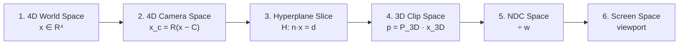

# 4D → 3D → 2D Pipeline

Canonical copy (infographic + stage table):

**[`docs/math4d/PIPELINE.md`](../../../../../docs/math4d/PIPELINE.md)**

This package implements that projection chain. It is **not** the holographic ρ / h_ij / COMPOSITE recorder.

| Stage | Formula | Facade | Status |
|-------|---------|--------|--------|
| 4D World Space | \(x \in \mathbb{R}^4\) | vec4 / Rot4 | **enforced** |
| 4D Camera Space | \(x_c = R(x-C)\) | `toCameraSpace` | **enforced** |
| Hyperplane Slice | \(H: n\cdot x = d\) → \(x_{3D}\) | `sliceTo3D` + `clipTriangle` | **enforced** |
| 3D Clip Space | \(p = P_{3D}\cdot x_{3D}\) | `toClipSpace` / `perspectiveP3D` | **enforced** |
| NDC Space | divide by \(w\) | `clipToNdc` | **enforced** |
| Screen Space | viewport → pixels | `ndcToScreen` | **partial** (raster/shade/post **declared**) |
| Temporal Extrusion | \(V=\{(x,w)\mid x\in M(t), w=t\}\) | `extrudeBetween` | **partial** |

`Camera4D.orientation` is world pose; diagram \(R\) is view rotation (`R_view = R_pose^T`). After clip, infographic \(x_c\) means clip, not camera space.

Math-first contract (same stack, not a second system): **[`docs/math4d/CONTRACT.md`](../../../../../docs/math4d/CONTRACT.md)**.  
`transformPipeline` ≡ \(\Pi_{3\to 2} \circ \Pi_{4\to 3} \circ R_4\). Layers: math **enforced** · numeric **partial** · physical **declared**.

Compose / compiler / Rosetta: **[`docs/math4d/ROSETTA.md`](../../../../../docs/math4d/ROSETTA.md)** (`JOBS`, `buildSharedState`; status **partial**).

Import: `@mrs/renderer-core/math4d` → `transformPipeline`, `evaluateMathContract`. Tests: `npm run test:math4d`.
