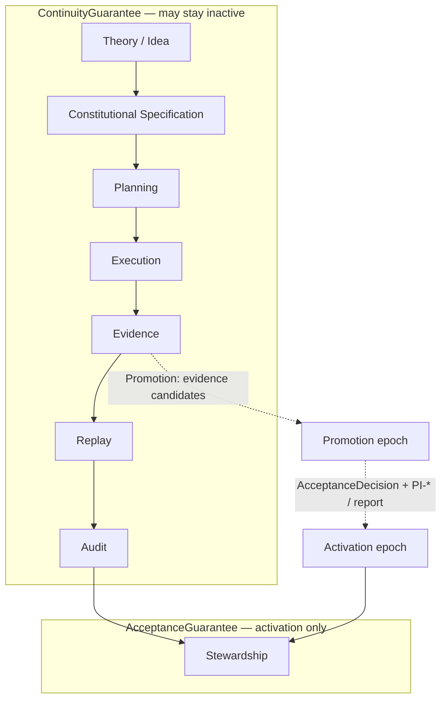

# SX-PTIG — Sovereign X Temporal Idea Governance

**Capability:** `sovereignx.temporal-idea-governance.v1`  
**Machine SoT:** [`lifecycle.json`](./lifecycle.json)  
**Code:** [`SovereignXTemporalIdeaGovernance.js`](./SovereignXTemporalIdeaGovernance.js)  
**Tests:** [`SovereignXTemporalIdeaGovernance.test.js`](./SovereignXTemporalIdeaGovernance.test.js)

> **Drive-G-1:** Continuity≠acceptance is **specified** here. Epoch classification heuristics are **tested**. System-wide CI-* mapping into JCK / COS / CER / ERS / RAC is **declared** only. This is **not** full CKL enforcement of PTIG.

## Critical refinement — two independent guarantees

| Guarantee | Meaning | Implies the other? |
|-----------|---------|--------------------|
| **ContinuityGuarantee** (preservation) | No idea loses identity, lineage, provenance, or context. Ideas may remain **inactive**. | **Must NOT** imply acceptance |
| **AcceptanceGuarantee** (activation) | Only evidence-backed ideas become constitutional artifacts when invariants, predicates, and evidence satisfy activation criteria | Presupposes continuity (identity retained) |

Constitutional **preservation** must **not** imply constitutional **acceptance**. This aligns with the evidence-first philosophy of CROS (CI-004), 4DRS PI-* / `acceptConformanceReport`, and conformance honesty.

## Common constitutional lifecycle

```
Theory / Idea
→ Constitutional Specification
→ Planning
→ Execution
→ Evidence
→ Replay
→ Audit
→ Stewardship
```



## Epochs

| Epoch | Continuity-only? | Role | Status |
|-------|------------------|------|--------|
| **Substrate** | Yes | Idea identity exists | **tested** (classifier) |
| **Substration** | Yes | Lineage / provenance bound; still inactive | **tested** |
| **Promotion** | No (still not accepted) | Attaches **evidence candidates**; does not activate | **tested** |
| **Activation** | No | Requires acceptance criteria (PI-* pass / ConformanceReport / soft-or-enforce AcceptanceDecision) | **tested** |

Activity states:

- `preserved_inactive` — ContinuityGuarantee only  
- `accepted_activated` — ContinuityGuarantee **and** AcceptanceGuarantee  

## Routing heuristics (tested ≠ enforced)

| Rule | Behavior | Status |
|------|----------|--------|
| Continuity without acceptance | Preserve inactive through Substrate / Substration / Promotion | **tested** |
| Acceptance requires evidence | `activate` denied without evidence + AcceptanceDecision-shaped accept | **tested** |
| Discard without review | Denied when `reviewStatus` is missing / not reviewed | **declared** (heuristic unit-tested as deny; not in `default.policies.json`) |

Acceptance hooks **duck-type** the shape returned by `acceptConformanceReport` (`verdict`, `ok`, `acceptanceEvidence.allRequiredPassed`). PTIG does **not** import `crossRuntime` (avoids cycles).

## Cross-system framing

| Surface | Link | Honest status |
|---------|------|---------------|
| CROS CI-001..006 | [`mrs/packages/cros/constitution/`](../../../../cros/constitution/) | Package-local validators **partial**; system-wide guarantee mapping **declared** |
| PI-* contracts | [`../render/rt4d/invariants/`](../../render/rt4d/invariants/) + STACK | **tested** math / soft CKL accept; not default deny |
| 4DRS stack | [`STACK.md`](../../render/rt4d/invariants/STACK.md) | Documented hierarchy |
| SX-PTIG (this) | `gpu/constitution/` | Epoch heuristics **tested**; CKL PTIG **not claimed** |

### CI-* → JCK / COS / CER / ERS / RAC

The refinement proposes mapping CROS CI-* into **JCK, COS, CER, ERS, RAC** as **system-wide** guarantees (not render-only).

| Token | In-repo expansion found? | Status |
|-------|--------------------------|--------|
| CER | Yes — **content evidence** (`mrs/apps/genblaze-media/docs/constitutional/CH-GNMD-v1.0.md`) | **declared** mapping |
| JCK | No expansion found — not invented | **declared** token only |
| COS | No expansion found — not invented | **declared** token only |
| ERS | No expansion found — not invented | **declared** token only |
| RAC | No expansion found — not invented | **declared** token only |

Do **not** treat this table as enforcement.

## Non-claims

- Not Story Forge  
- Not full CKL enforcement of PTIG  
- Continuity ≠ acceptance  
- Promotion ≠ activation  
- Genblaze / Seedance hosts are out of scope for this package path  

## Tests

```bash
node --test src/gpu/constitution/SovereignXTemporalIdeaGovernance.test.js
```

From `mrs/packages/renderer-core`.
