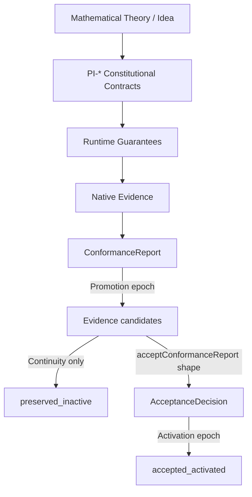

# 4DRS Invariants × SX-PTIG Lifecycle

> Additive link from the PI-* / EI-* stack to Temporal Idea Governance.  
> **Drive-G-1:** Does not claim CKL enforcement of PTIG.

**PTIG:** [`../../../gpu/constitution/SX-PTIG.md`](../../../gpu/constitution/SX-PTIG.md)  
**Stack:** [`STACK.md`](./STACK.md)  
**CROS bridge:** [`../../../../cros/constitution/LIFECYCLE.md`](../../../../cros/constitution/LIFECYCLE.md)

## Continuity vs Acceptance (PI-* view)

| Guarantee | PI-* / cross-runtime meaning |
|-----------|------------------------------|
| ContinuityGuarantee | Idea / contract IDs and evidence **candidates** may exist without soft/enforce accept |
| AcceptanceGuarantee | `acceptConformanceReport` (or duck-typed AcceptanceDecision) with required PI-* pass |

Promotion epoch ≈ attaching ConformanceReport / evidence candidates.  
Activation epoch ≈ AcceptanceDecision `verdict: accept` (soft or enforce).

## Status

| Claim | Status |
|-------|--------|
| Epoch classification in SX-PTIG | **tested** |
| Soft/enforce PI acceptance | **accepted** / opt-in **enforced** (existing crossRuntime) |
| PTIG as default CKL policy | **not claimed** |
| CI-* → JCK/COS/CER/ERS/RAC system-wide | **declared** |
