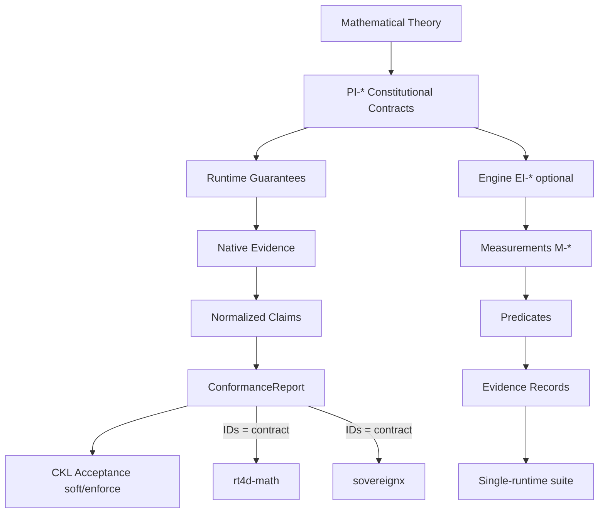

# 4DRS Invariant Stack

**Package path:** `mrs/packages/renderer-core/src/render/rt4d/invariants/`
**Related math SoT:** `../math/physicalInvariants.js`
**Distinct from:** CROS CI-001..006 (`mrs/packages/cros/`) — do not merge compliance claims.

## Hierarchy

```
Mathematical Theory
        ↓
PI-* Constitutional Contracts   (PI-GEO-LENGTH, PI-CALC-ENERGY, PI-TRIG-RADIAL)
        ↓
Runtime Guarantees              (per-host how-satisfied)
        ↓
Native Evidence → Normalized Claims → ConformanceReport
        ↓
CKL Acceptance                  (soft attach | opt-in enforce)
```

Engine EI-* remain a **derived** runtime layer (not in the required contractual acceptance set):

```
PI-* Contracts → EI-* Runtime Guarantees (optional) → M-* → Predicates → Evidence
```



## Status vocabulary (Drive-G-1)

| Tag | Meaning |
|-----|---------|
| **enforced** | Unit tests **and** a runtime/CKL gate that can deny execution |
| **accepted** | CKL soft path attaches acceptance evidence from a verified ConformanceReport |
| **tested** | Unit tests pass; **no** runtime gate |
| **declared** | Specified in catalog/docs; not numerically proven in this suite |
| **skeleton** | Stub / type / unevaluated predicate only |

**Default renders are not denied.** Soft acceptance is opt-in via `acceptConformanceReport`. Enforce deny requires `enforcePhysicalInvariantConformance: true`.
## Catalog

| Invariant ID | Layer | derived_from | Status | Evidence |
|--------------|-------|--------------|--------|----------|
| PI-GEO-LENGTH | foundational | — | **tested** | `math/physicalInvariants.js`, `test/physicalInvariants.test.js` |
| PI-CALC-ENERGY | foundational | — | **tested** | same |
| PI-TRIG-RADIAL | foundational | — | **tested** | same |
| EI-PROJ-FIDELITY | engine | PI-GEO-LENGTH, PI-TRIG-RADIAL | **tested** | `output/projector.js`, `predicates.js::projectionFidelityHolds` |
| EI-REPLAY-DETERMINISM | engine | PI-CALC-ENERGY | **declared** | `docs/4drs/substrate/DETERMINISTIC_REPLAY.md`, `CPUConformanceGate.js`, constitutional `replay.deterministic-params` |
| EI-RADIOMETRIC | engine | PI-CALC-ENERGY, PI-TRIG-RADIAL | **tested** | `bsdf4d.js`, `s3.js`, `normalization.test.js` (anchors BRDF = 3ρ/(4π), pdf = 3cosθ/(4π) — **not redefined**) |
| EI-TOPOLOGY | engine | PI-GEO-LENGTH | **skeleton** | `BVH4D.js`, `HyperBox.js` present; containment predicate **not** implemented |
| EI-LENGTH-PARENT | engine | PI-GEO-LENGTH, PI-TRIG-RADIAL | **tested** | `Transform4D.rotate` + `lengthPreserved4` |

## How a future runtime proves conformance

1. Implement a **runtime adapter** `{ id, provideMeasurement(invariantId) }`.
2. Call `runInvariantConformanceSuite(adapter)`.
3. Collect `EvidenceRecord`s (`schema: 4drs.invariant.evidence.v1`).
4. Treat verdicts honestly:
   - foundational PI `pass` → math predicates hold on supplied measurements
   - engine `pass` with catalogStatus `tested` → unit-level proof only
   - `partial` / `unevaluated` → supporting measurement only or stub
5. **Do not** claim CKL/runtime enforcement until a gate wires these IDs into deny paths.
6. Keep CROS CI-* evidence packages separate; cross-link profiles if useful.

## Modules

| File | Role |
|------|------|
| `foundational.js` | Register PI-* as foundational constitutional math invariants |
| `engineInvariants.js` | EI-* definitions + `derived_from` |
| `measurements.js` | M-* descriptors |
| `predicates.js` | Predicate runners (wire PI; engine tested/declared/skeleton) |
| `evidence.js` | EvidenceRecord factory + soft validate |
| `conformance.js` | Suite runner |
| `crossRuntime/` | Multi-host suite: IDs = contract; native evidence → ConformanceClaim |
| `index.js` | Public exports |

## Cross-runtime conformance + CKL acceptance

See [`crossRuntime/CROSS_RUNTIME.md`](./crossRuntime/CROSS_RUNTIME.md) and [`crossRuntime/CONSTITUTIONAL_CONTRACTS.md`](./crossRuntime/CONSTITUTIONAL_CONTRACTS.md).

- **Contract:** required PI-* Constitutional Contracts (optional EI-* when a host advertises them)
- **Evidence:** each host keeps its native schema
- **Envelope:** `4drs.cross-runtime.claim.v1` via `normalizeEvidence`
- **Report:** `ConformanceReport` (`4drs.cross-runtime.conformance.v1`) with `independentVerification`
- **Acceptance:** `acceptConformanceReport(report, { enforce })` — soft **accepted** / opt-in **enforced**
- **Not claimed:** unified schema enforcement, EI-* gate, deny-all default renders

## Tests

- `test/physicalInvariants.test.js` — foundational PI formulas
- `test/normalization.test.js` — radiometric anchors (23 tests; do not break)
- `test/invariants.stack.test.js` — catalog integrity / derived_from
- `test/invariants.conformance.test.js` — suite emits evidence; foundational pass
- `test/crossRuntime.conformance.test.js` — math + Sovereign X hosts vs PI-*
- `test/cklAcceptance.test.js` — soft attach / enforce deny / passing accept

## Next increments (roadmap — not present capability)

1. BVH parent/child containment predicate → promote EI-TOPOLOGY toward **tested**
2. Optional merge of `piConformancePolicies` into operator-selected CKL profiles (still not default.policies.json)
3. Additional hosts (Unity / Unreal) emitting native evidence + same IDs
4. Optional JSON Schema file for claim / ConformanceReport / AcceptanceDecision under `schemas/`

## Cross-links

- Physical invariants note: [`../math/physical_invariants.md`](../math/physical_invariants.md)
- Docs mirror: [`docs/4drs/contracts/INVARIANT_STACK.md`](../../../../../../../docs/4drs/contracts/INVARIANT_STACK.md)
- MRS-IC (inspector invariants — separate): [`docs/4drs/contracts/MRS-IC-v1.2.md`](../../../../../../../docs/4drs/contracts/MRS-IC-v1.2.md)
- CROS (creative render OS — separate): `mrs/packages/cros/constitution/invariants.json`
- SX-PTIG lifecycle (continuity ≠ acceptance): [`LIFECYCLE.md`](./LIFECYCLE.md), [`../../../gpu/constitution/SX-PTIG.md`](../../../gpu/constitution/SX-PTIG.md)
